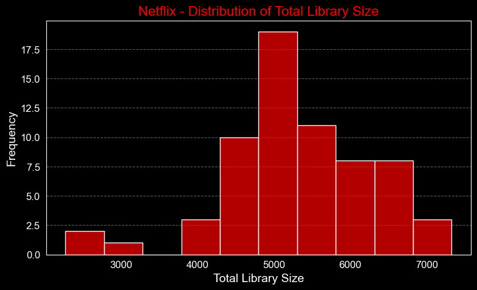

# The-Science-Behind-Netflix-Pricing

📌Insights on why there is difference in pricing and deep Analysis on the pricing strategy 

📌In this project, data analysis was made on Netflix, a movie and series viewing platform.

📌The prices of the basic, standard and premium packages of Netflix according to the countries have been examined.

📌According to these data, exploratory data analysis was carried out and data visualization was made according to the results of this analysis.

## Author

- [@Chethan Karunakara](https://www.linkedin.com/in/chethan-karunakara-19571b1b9/) for design and development.

# Introduction :

    Netflix, Inc. is an American innovation and media administrations supplier and production company headquartered in California. It was established in 1997 by Reed Hastings and Marc Randolph in California. The company's center commerce is a paid subscription-based video streaming service.

    
Content:
1. [Variable Description](#3)
    * [Univarite Variable Analysis](#4)
        * [Categorical Variable Analysis](#5)
        * [Numerical Variable Analysis](#6)
1. [Missing Value](#7)
1. [Unique Values](#8)
1. [Data Visualization](#9)
    * [Plotly](#10)
    * [Seaborn](#11)
    * [Linear Regression](#12)
1. [Conclusion](#13)
   
 
# Variable Description 🚀

* __Country:__ Some countries where Netflix is used.
* __Total Library Size:__ Total number of movies and TV series aired in the country.
* __No. of TV Shows:__ Total number of TV series broadcast in the country.
* __No. of Movies:__ Total number of movies released in the country.
* __Cost Per Month - Basic:__ The monthly price of the __"basic package".__
* __Cost Per Month - Standard:__ The monthly price of the __"standard package".__
* __Cost Per Month - Premium:__ The monthly price of the __"premium package".__

 
# Univarite Variable Analysis ⚠️
* __Categorical Variable :__ Country
* __Numerical Variable :__ Total Library Size, No. of TV Shows, No. of Movies, Cost Per Month - Basic, Cost Per Month - Standard, Cost Per Month - Premium

 
# Data Visualization 📊

Visualization libraries such as __seaborn, matplotlib and plotly__ are used here.

 
### Plotly🔥

* **The prices of basic, standard and premium packages by country were visualized.**

### Geographical Pricing Strategy: 
Netflix employs a region-based pricing strategy. The cost variation across countries could be influenced by several factors including local economic conditions, average income levels, purchasing power parity, and local competition. For example, a higher price in one country might be due to greater purchasing power or less competition from other streaming services.

### Market Penetration Goals:
Netflix sometimes set lower prices in emerging markets to attract more subscribers and achieve market penetration. The goal might be to build a customer base quickly, especially in regions where digital streaming might be a relatively new concept.

### Cost Adaptation to Local Content and Licensing:
The cost may also reflect the amount and type of content available in each country. Licensing agreements for content are negotiated on a country-by-country basis, and the cost structure might reflect these agreements. Some countries might have a rich catalog of local content that's less expensive to license, allowing for lower subscription costs.

### Strategic Positioning:
In some countries, Netflix might face stiff competition from local streaming services, which could force it to adopt a more aggressive pricing strategy. Conversely, in markets where it holds a dominant position, it might price its services higher due to the lack of significant competition.

### Cultural Value of Media Consumption: 
In cultures where media consumption is highly valued and paid subscriptions are a norm, Netflix might price its services higher due to the higher perceived value. Conversely, in countries where free-to-air TV or piracy is rampant, they may need to lower the price to make the legal option more attractive.

## Why is Switzerland and Liechtenstein are so high ??
Cost of Living and Purchasing Power comes into play here the cost of living and average income are higher than in the United States. This could mean that consumers in these countries are able to afford higher subscription prices.The size and quality of the content library can vary significantly by country. In some countries, Netflix may offer a larger or more desirable selection of shows and movies, which can justify a higher subscription cost.Some European countries have a higher willingness to pay for digital services, which could explain why the prices are higher despite not all being classified as more developed than the US.

# Diffrence with Pricing and Library Size 
The graph depicting Netflix's library size against the subscription cost for selected countries reveals a nuanced pricing strategy. It appears that the subscription cost doesn't always correlate with the total library size, suggesting that factors beyond content volume influence pricing. For instance, higher-priced regions might reflect Netflix's market dominance or higher operating costs, while a larger library size in more competitive or economically diverse regions doesn't necessarily equate to higher prices, possibly due to strategic pricing to attract subscribers. This indicates that Netflix tailors its offerings and pricing to local market dynamics rather than adopting a one-size-fits-all approach.

 
### Seaborn⭐

 
# Linear regression Analysis and its Results:
This result had The R-squared value obtained from the regression analysis was very low, indicating that the linear model does not effectively predict the 'Cost Per Month - Basic ($)' based on 'Total Library Size'. This suggests that the relationship between these two variables is not strongly linear, and other factors might influence subscription costs.

